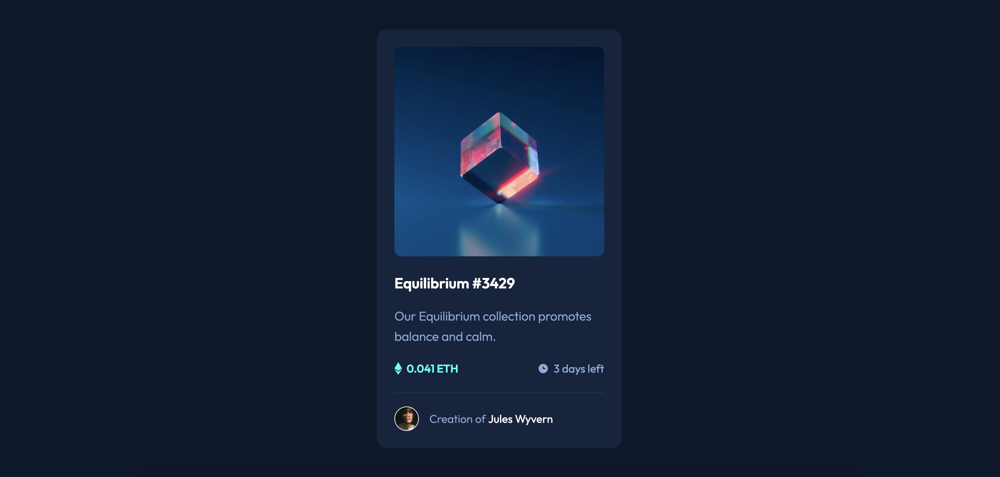

# Frontend Mentor - NFT preview card component solution

This is a solution to the [NFT preview card component challenge on Frontend Mentor](https://www.frontendmentor.io/challenges/nft-preview-card-component-SbdUL_w0U). Frontend Mentor challenges help you improve your coding skills by building realistic projects. 

## Table of contents

- [Overview](#overview)
  - [The challenge](#the-challenge)
  - [Screenshot](#screenshot)
  - [Links](#links)
- [My process](#my-process)
  - [Built with](#built-with)
  - [What I learned](#what-i-learned)
  - [Continued development](#continued-development)
- [Author](#author)

## Overview

### The challenge

Users should be able to:

- View the optimal layout depending on their device's screen size
- See hover states for interactive elements

### Screenshot



### Links

- Solution URL: [Solution URL](https://www.frontendmentor.io/solutions/nft-preview-card-component-challenge-solution-using-css-grid-iRjtg56k9s)
- Live Site URL: [Live site URL](https://leo-code-ca.github.io/NFT-preview-card-component/)

## My process

### Built with

- Semantic HTML5 markup
- CSS custom properties
- Flexbox
- CSS Grid
- Mobile-first workflow

### What I learned

I'm glad I had the chance to work with SVG again. It's still new for me and I'm really motivated to learn how to use or even create them!

I managed to create my image overlay without struggling too much, that's great because a few weeks ago, it was still hard for me to figure that out!

```css
.icon-background {
    position: absolute;
    top: 0;
    width: 100%;
    height: 0;
    opacity: 0;
    display: flex;
    justify-content: center;
    align-items: center;
    transition: all 1s ease-in-out;
}

.image-container:hover .icon-background {
    height: 100%;
    opacity: 1;
}
```

The animation was not required by the challenge but it was so pleasant to code! I definitely like interactive content! I feel more and more comfortable with css transitions and animations, I'm looking forward to create some more in my next projects!

```css
@keyframes attribution {
    0% {
        left: 0; 
        transform: translate(-100%) rotate(0);
    }
    5% {
        left: 60%; 
        transform: translate(-60%) rotate(10deg);
    }
    10% {
        left: 40%; 
        transform: translate(-40%) rotate(-7deg);
    }
    15% {
        left: 60%; 
        transform: translate(-60%) rotate(5deg);
    }
    20% {
        left: 40%; 
        transform: translate(-40%) rotate(-3deg);
    }
    25% {
        left: 50%; transform: translate(-50%);
    }
    75% {
        left: 50%; transform: translate(-50%);
    }
    100% {
        left: 100%; transform: translate(0);
    }
}
```

### Continued development

I definitely want to keep working on CSS grids. I think I have understood the basics but now, I'll have to try to build more complex layouts! 

## Author

- Frontend Mentor - [@Leo-Code-CA](https://www.frontendmentor.io/profile/Leo-Code-CA)
- FreeCodeCamp - [@Leo-code](https://www.freecodecamp.org/Leo-code)

